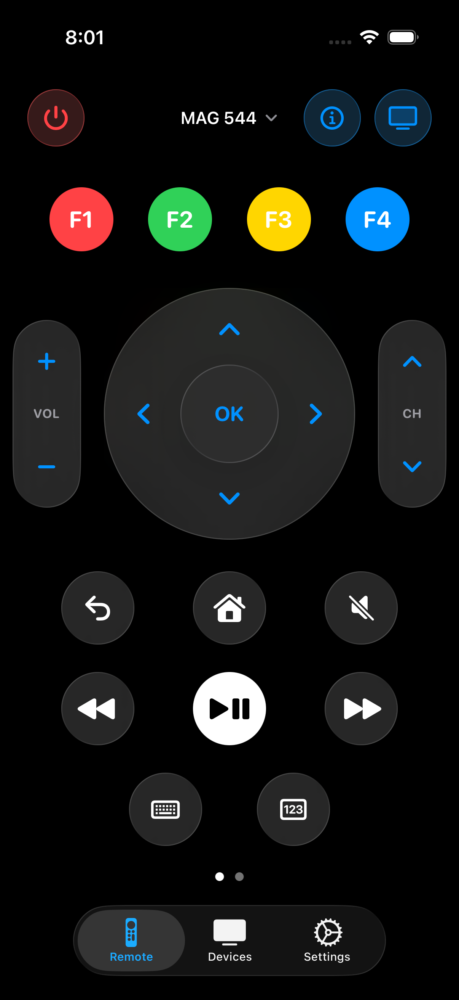
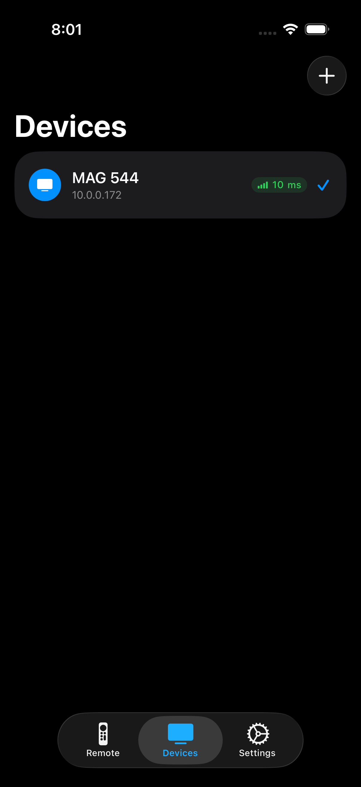
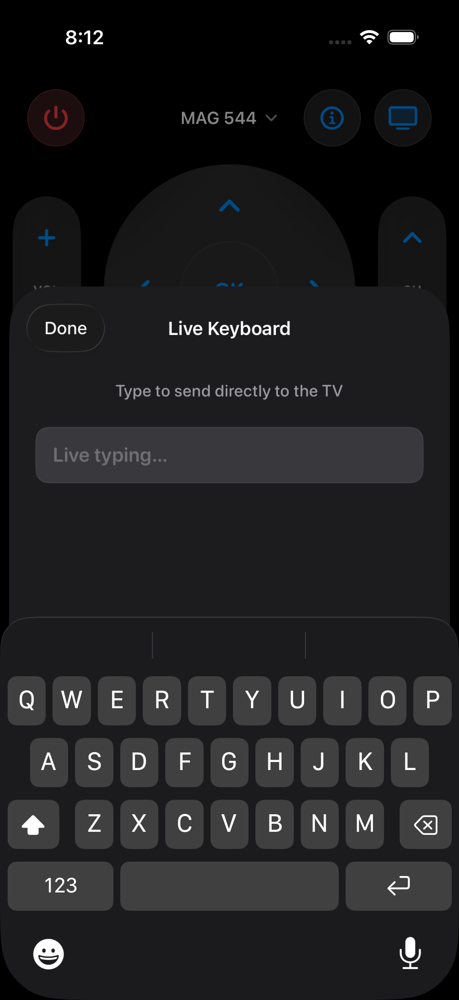
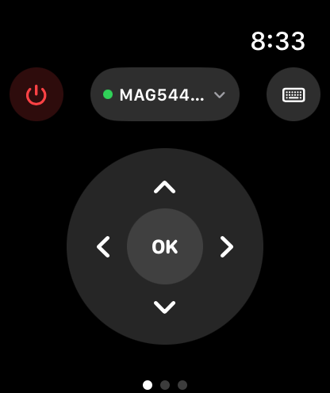

# Universal Remote for MAG

**A fast, reliable third-party remote control for MAG series set-top boxes.**

Control channels, volume, playback, and navigation directly from your iPhone, iPad, or Apple Watch. Built natively for iOS, Universal Remote for MAG communicates seamlessly over your local Wi-Fi network to replace or supplement your physical remote.

  

---

## Features

### Seamless Local Control
Connect to your hardware instantly without creating an account or signing into any cloud services.
* Pair directly to your MAG box over your home Wi-Fi network.
* Monitor your connection stability with real-time network ping indicators built into the device manager.

  

### Live Keyboard Input
Typing on a TV with a directional pad is frustrating. 
* Use the native iOS keyboard to send text strings directly to your set-top box search fields and input forms.

  

### Apple Watch Integration
Take control of your television without reaching for your phone.
* Access dedicated media controls, directional navigation, and a full number pad directly from your wrist.
* Switch between multiple saved MAG boxes seamlessly via the watchOS device list.

  

### System Integrations
Universal Remote for MAG hooks directly into modern iOS environments.
* Access your remote instantly using customizable Home Screen and Lock Screen widgets.
* Automate your living room setup using native Siri Shortcuts.

---

## Hardware Compatibility

Universal Remote for MAG officially supports the following models:
`MAG245` · `MAG245D` · `MAG250` · `MAG254` · `MAG255` · `MAG260` · `MAG270` · `MAG275` · `MAG324` · `MAG420` · `MAG520` · `MAG540`

---

## Troubleshooting & FAQ

**The app cannot find my set-top box.**
Ensure your iPhone and MAG box are connected to the exact same Wi-Fi network. If your router separates 2.4 GHz and 5 GHz bands, verify both devices are on the same band. 

**My device is found, but the remote does not respond.**
Remote access must be enabled manually on your hardware. Navigate to **Settings → System settings → Remote control** on your MAG box and toggle it on. 

**General Connection Issues**
If pairing fails, restart both the set-top box and the iOS application, then attempt to pair again via the Devices tab. For maximum stability, ensure your MAG box is updated to the latest official Infomir firmware.

---

## Support & Legal

* **Report an Issue:** Use the **Settings → Send Feedback** button inside the app to generate a debug email, or open a ticket on our [GitHub Issues page](https://github.com/shubhamshah02/MAGmate/issues). Please include your iOS version and MAG box model. Expect a response within 48 hours.
* **Privacy & Terms:** Review our [Privacy Policy](https://shubhamshah02.github.io/MAGmate/privacy.html) and [Terms of Use](https://shubhamshah02.github.io/MAGmate/terms.html).

*Disclaimer: Universal Remote for MAG is an independent third-party application. It is not affiliated with, endorsed by, or sponsored by Infomir or Telecommunication Technologies.*
